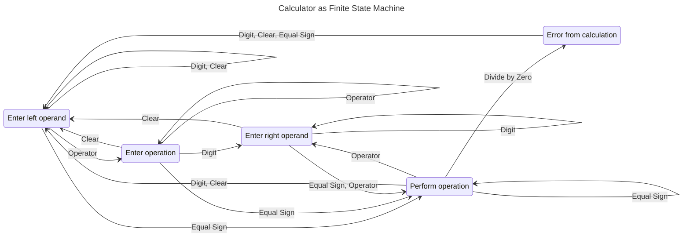

# calculator

```mermaid
---
title: Calculator as Finite State Machine
---
stateDiagram-v2

  direction LR
  Left: Enter left operand
  Operation: Enter operation
  Right: Enter right operand
  Perform: Perform operation
  Error: Error from calculation

  Left --> Operation: Operator
  Left --> Perform: Equal Sign
  Left --> Left: Digit, Clear
  
  Operation --> Right: Digit
  Operation --> Left: Clear
  Operation --> Operation: Operator
  Operation --> Perform: Equal Sign

  Right --> Perform: Equal Sign, Operator
  Right --> Left: Clear
  Right --> Right: Digit

  Perform --> Left: Digit, Clear
  Perform --> Right: Operator
  Perform --> Perform: Equal Sign
  Perform --> Error: Divide by Zero

  Error --> Left: Digit, Clear, Equal Sign
```