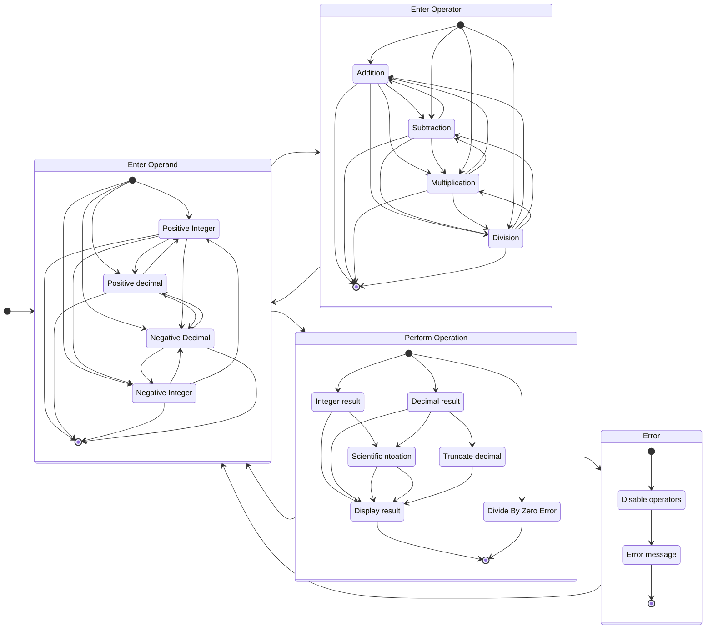

# calculator

```mermaid
stateDiagram-v2

  direction LR
  [*] --> Operand

  Operand: Enter Operand
  state Operand {
    Integer: Positive Integer
    NegativeInteger: Negative Integer
    Decimal: Positive decimal    
    NegativeDecimal: Negative Decimal

    [*] --> Integer
    [*] --> Decimal
    [*] --> NegativeInteger
    [*] --> NegativeDecimal

    Integer --> Decimal
    Integer --> NegativeDecimal
    Integer --> NegativeInteger

    Decimal --> Integer
    Decimal --> NegativeDecimal

    NegativeInteger --> NegativeDecimal
    NegativeInteger --> Integer

    NegativeDecimal --> NegativeInteger
    NegativeDecimal --> Decimal

    Integer --> [*]
    Decimal --> [*]
    NegativeInteger --> [*]
    NegativeDecimal --> [*]
  }

  Operand --> Operator

  Operator: Enter Operator
  state Operator {

    [*] --> Addition
    Addition --> Subtraction
    Addition --> Multiplication
    Addition --> Division

    [*] --> Subtraction
    Subtraction --> Addition
    Subtraction --> Multiplication
    Subtraction --> Division

    [*] --> Multiplication
    Multiplication --> Addition
    Multiplication --> Subtraction
    Multiplication --> Division

    [*] --> Division
    Division --> Addition
    Division --> Subtraction
    Division --> Multiplication

    Addition --> [*]
    Subtraction --> [*]
    Multiplication --> [*]
    Division --> [*]
  }

  Operator --> Operand
  Operand --> Perform

  Perform: Perform Operation
  state Perform {
    IntegerResult: Integer result
    DecimalResult: Decimal result
    DivideByZero: Divide By Zero Error
    Truncate: Truncate decimal
    Display: Display result 
    SciNotation: Scientific ntoation

    [*] --> IntegerResult
    [*] --> DecimalResult
    [*] --> DivideByZero

    IntegerResult --> Display
    DecimalResult --> Display

    IntegerResult --> SciNotation
    DecimalResult --> SciNotation
    SciNotation --> Display
    SciNotation --> Display

    DecimalResult --> Truncate
    Truncate --> Display

    Display --> [*]
    DivideByZero --> [*]
  }

  Perform --> Operand
  Perform --> Error

  state Error {
    Disable: Disable operators
    Message: Error message

    [*] --> Disable
    Disable --> Message
    Message --> [*]
  }

  Error --> Operand

```