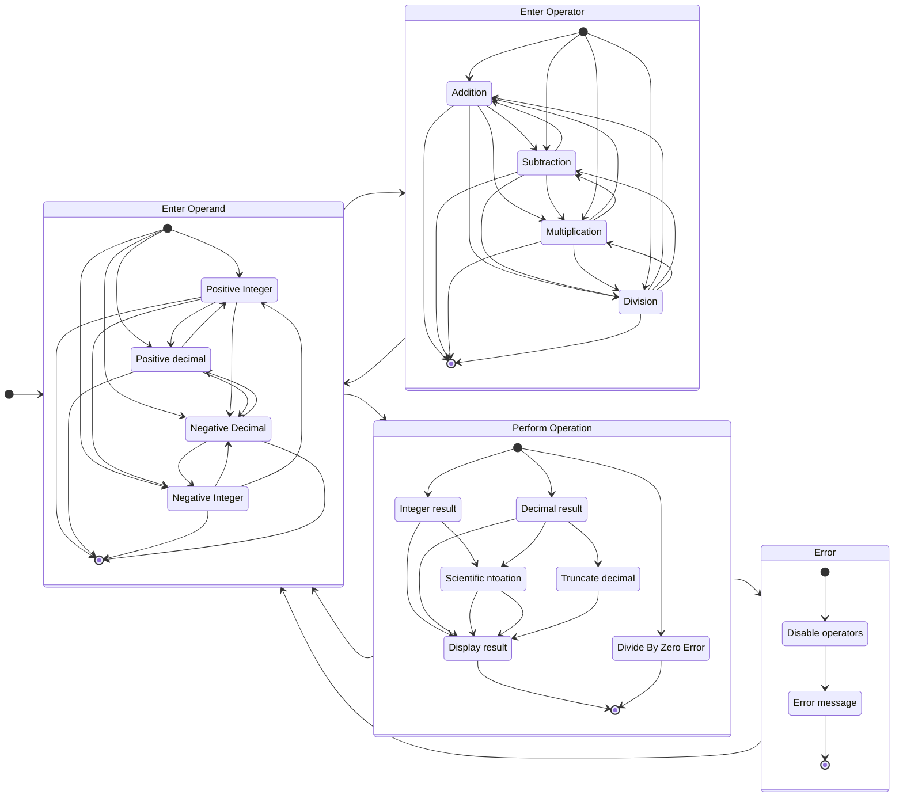

# calculator

The capstone project of the Foundations course is a calculator with basic operations. The calculator performs simple addition, subtraction, multiplication, and division between positive and negative numbers and decimal values. The calculator takes input from the buttons on the keypad and from the keyboard and stores the numbers and operators entered to perform the calculation. The display of the calaculator is updated with the result of the calculation.

This project submission is based on the standard mode of the Windows Calculator for Windows 11 with the design and functionality, keyboard shortcuts, and implementation of operations based on the actual application software. Modifications and simplifications to the implementation of calculator were made to align with the scope of the project.

## Keyboard Shortcuts
*For more information about keyboard shortcuts for the Windows Calculator for Windows 11, click [here](https://support.microsoft.com/en-us/windows/keyboard-shortcuts-in-apps-139014e7-177b-d1f3-eb2e-7298b2599a34#bkmk_cal).*

|        |        |
| --- | --- |
| `Delete` | Clear entry (CE) |
| `Esc` | Clear (C) |
| `Backspace` | Delete previous character |
| `Shift` + `+` | Addition
| `-` | Subtraction
| `Shift` + `*` | Multiplication
| `/` | Division
| `Enter` or `=` | Perform calculation
| `Fn` + `F9` | Negate number
| `.` | Convert to decimal

## Calculator as Finite State Machine

*For more information about finite state machines, click [here](https://en.wikipedia.org/wiki/Finite-state_machine).*  
*For more information about state diagrams, click [here](https://en.wikipedia.org/wiki/State_diagram).*

