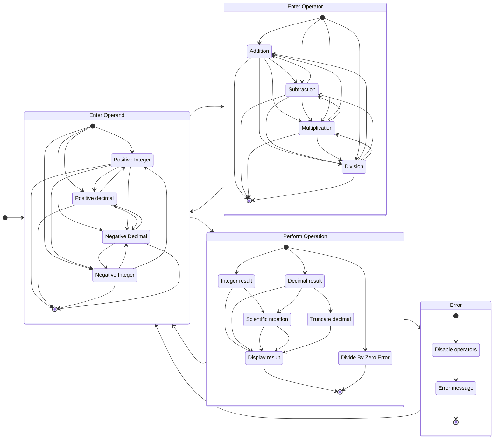

# calculator

The capstone project of the Foundations course is a calculator with basic operations. The calculator performs simple addition, subtraction, multiplication, and division between positive and negative numbers and decimal values. The calculator takes input from the buttons on the keypad and from the keyboard and stores the numbers and operators entered to perform the calculation. The display of the calaculator is updated with the result of the calculation.

This project submission is based on the standard mode of the Windows Calculator for Windows 11 with the design and functionality, keyboard shortcuts, and implementation of operations based on the actual application software. Modifications and simplifications to the implementation of calculator were made to align with the scope of the project.

## Keyboard Shortcuts
*For more information about keyboard shortcuts for the Windows Calculator for Windows 11, click [here](https://support.microsoft.com/en-us/windows/keyboard-shortcuts-in-apps-139014e7-177b-d1f3-eb2e-7298b2599a34#bkmk_cal).*

|        |        |
| --- | --- |
| `Delete` | Clear entry (CE) |
| `Esc` | Clear (C) |
| `Backspace` | Delete previous character |
| `Shift` + `+` | Addition
| `-` | Subtraction
| `Shift` + `*` | Multiplication
| `/` | Division
| `Enter` or `=` | Perform calculation
| `Fn` + `F9` | Negate number
| `.` | Convert to decimal

## Calculator as Finite State Machine

*Please see this [Reddit post](https://www.reddit.com/r/learnprogramming/comments/vkm9cr/how_to_clear_a_first_number_from_a_calculators/) which inspired me to learn about finite state machines and state diagrams when I encountered a problem with clearing the display when an operator is selected to enter digits for the other operand. Thank you to [u/bsakiag](https://www.reddit.com/user/bsakiag/) for their explanation and breakdown of the problem and [u/Fuegobruh](https://www.reddit.com/user/Fuegobruh/) for posting this question.*

### Background

> Make sure that your calculator only runs an operation when supplied with two numbers and an operator by the user. Example: you enter a number (2), followed by an operator button (+). You press the operator button (+) a second consecutive time. Your calculator should not evaluate this as (2 + 2) and should not display the result (4). If consecutive operator buttons are pressed, your calculator should not run any evaluations, it should only take the last operator entered to be used for the next operation.

When we write functions, we look for blocks of code which are repeated throughout our program and give them a descriptive and informative name with which we can call those blocks of code wherever and whenever in our program. Choosing names for our functions is a conscious decision because the names of functions should convey the purpose of the function and the outcome from calling the function. We write functions to solve problems with recurring patterns instead of repeating the same code and abstract away the details of the implementation when the function performs the intended operations and produces the expected outcome every single time when we call the function.

*For more information about contracts and exceptions, click [here](https://ics.uci.edu/~thornton/ics46/Notes/ContractsAndExceptions/).*

Functions which perform their intended operations and produce the expected outcome every single time are implemented alongside contracts which are the formal specifications for the intended behavior of the function and the assumptions made about the function. 

There are three components to the contract concerning the intended behavior of the function and assumptions made about the function.
- The precondition refers to the assumptions which must be true before the function is called.
- The postcondition refers to the assumptions which must be true after the function is called.
- Side effects are outcomes produced from the function other than returning a value.

When functions are implemented with preconditions and postconditions in mind, functions become predictable and reliable. The implementation details of the function are no longer a concern when the assumptions about the function are no longer a concern. Functions peform their intended operations and produce the expected outcome no more and no less.

### States and Transitions

*For more information about finite state machines, click [here](https://en.wikipedia.org/wiki/Finite-state_machine).*

When we learned about DOM manipulation and events, we followed the programming paradigm of event-driven programming. We implemented event listeners for buttons to perform actions when clicked and the color of the square of the grid to change to a random color and darken with each interaction when hovering the mouse over them. We also implemented our own custom events and dispatched them to the corresponding target element when none of the built-in events suited the needs of our program.

The programming paradigm of event-driven programming is a suitable approach for the implementation of the calaculator because the use cases of the calculator require user interaction with the calaculator. The user presses the buttons on the calculator and types on the keyboard to enter numbers into the calculator and perform the calculation. The calculator handles user interaction as external events based on the buttons which were pressed and the keyboard shortcuts which were pressed to store the numbers entered into the calaculator and perform the correct calculation to update the display with the correct information.

To better understand user interaction as external events, the calculator can modeled as a machine with states and transitions between states when the user interacts with the calculator.

| Current State | Input | Next State | Output |
| ------------- | ----- | ---------- | ------ |
| Enter operand | Digit | Enter Operand | Add digit to number
| Enter operand | `Fn` + `F9`  | Enter Operand | Negate number
| Enter operand | `.` | Enter Operand | Add decimal point
| Enter operand | `Delete`, `Esc`, `Backspace` | Enter Operand | Clear display |
| Enter operand | Operator | Enter Operator | None
| Enter operand | `Enter`, `=` | Perform Operation | Display curent number
| Enter operator | Digit | Enter Operand | Clear display and add digit
| Enter operator | `Fn` + `F9` | Enter Operand | Negate number
| Enter operator | `.` | Enter Operand | Clear display and add decimal point
| Enter operator | `Delete`, `Backspace`, `Esc` | Enter Operand | Clear display
| Enter operator | Operator | Enter Operator | None
| Enter operator | `Enter`, `=` | Perform Operation | Display result of calculation
| Perform Operation | Digit | Enter Operand | Clear display and add digit
| Perform Operation | `Fn` + `F9` | Enter Operand | Negate number
| Perform Operation | `.` | Enter Operand | Clear display and add decimal point
| Perform Operation | `Delete`, `Esc`, `Backspace` | Enter Operand | Clear display
| Perform Operation | Operator | Enter operator | None
| Perform Operation | `Enter`, `=` | Perform Operation | Display result of calculation
| Error | Digit | Enter Operand | Clear display and add digit
| Error | `Delete`, `Esc`, `Backspace` | Enter Operand | Clear display
| Error | Operator | Error | None
| Error | `Fn` + `F9` | Error | None
| Error | `.` | Error| None

- The calculator allows the user to enter numbers for the operand.
  - The user selects an operation.
-
- The calaculator performs the calaculation.
-

*For more information about state diagrams, click [here](https://en.wikipedia.org/wiki/State_diagram).*

